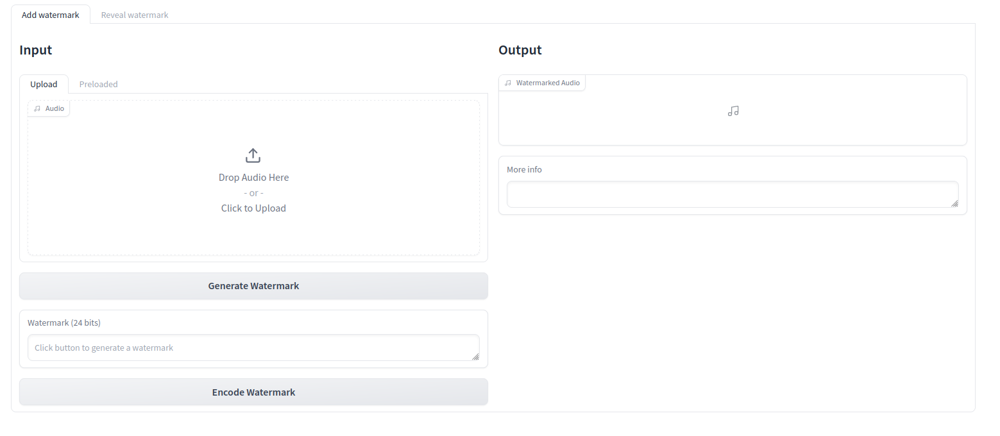
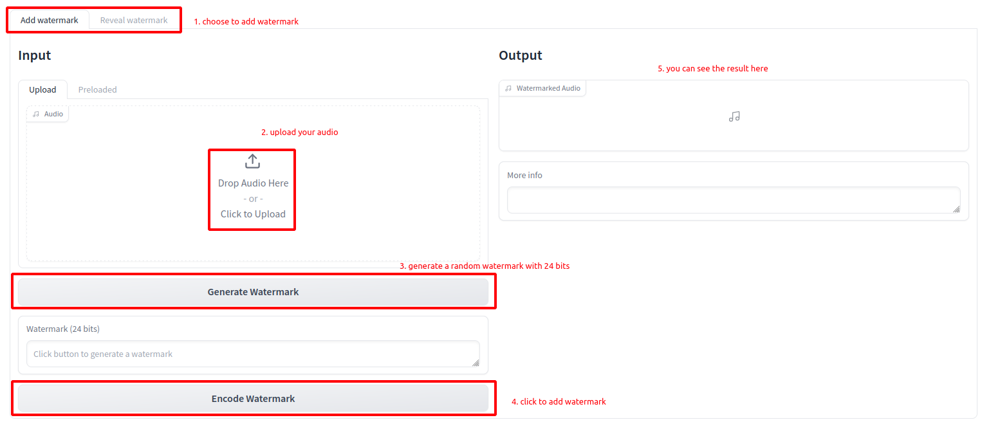
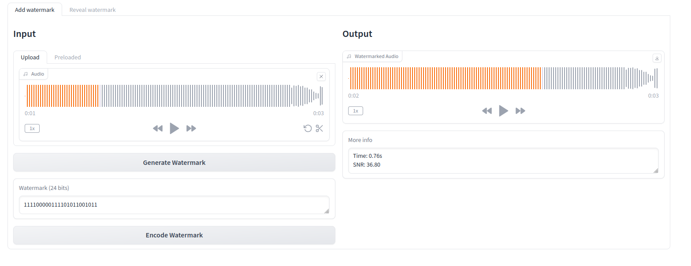
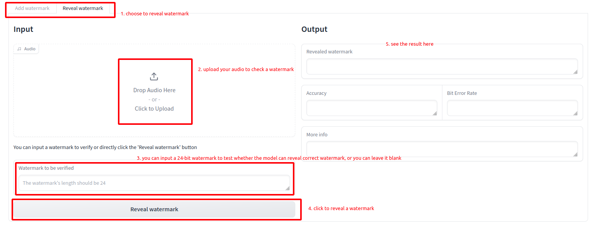
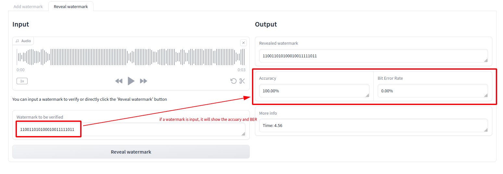
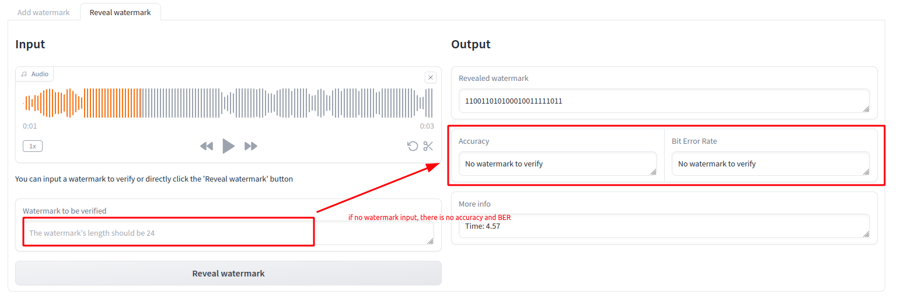

# Watermark Utility

A Gradio utility to watermark WAV files and check for existing watermarks.

## Requirements
Test in Python 3.10

```shell
gradio==4.1.1
matplotlib==3.7.2  # gradio 4.1.1 needs matplotlib 3.7.2
librosa==0.10.1
resampy==0.4.2
soundfile==0.12.1
numpy==1.26.0
torch==1.12.1
torchaudio==0.12.1
typing_extensions==4.8.0
```

## Usage

1. Run `demo_gradio.py`
2. Navigate to `http://127.0.0.1:7860`
3. See the GUI
   

### Add a watermark

You can upload your own audios or use preloaded audios, 
the following figure shows how to add a watermark using uploaded audios


After adding the watermark, the GUI is like this:


To use preloaded audios, please select the `Preloaded` tab.

### Check a watermark

The following figure shows how to check a watermark


After revealing a watermark with your watermark to verify,
 then it will show the accuracy and BER



If no watermark needs to be verified, it won't show the accuracy and BER
